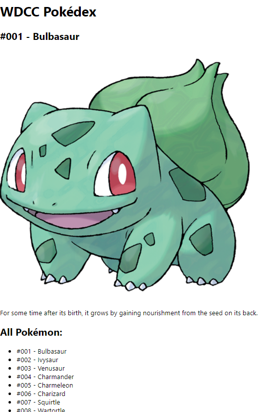

## Session One - A basic Pokédex
In the first session, we'll build some React components to represent the Pokédex. We'll start by displaying some hardcoded data, then move on to displaying the actual data contained within the provided [`pokemon.json`](./src/pokemon.json) file.

To begin, let's define some very basic requirements for our dex:

1. As a user, I want to be able to see a list of every Pokémon.
2. As a user, I want to be able to see detailed information about a specific Pokémon I select.

*(Feel free to add your own requirements to this list if you'd like to be more adventurous - but the steps in this lab will focus on satisfying these requirements)*

We can satisfy those requirements by having a page with a couple of distinct areas: one area displaying a list of Pokémon, and another displaying one particular Pokémon's detailed statistics. We will display Pokémons' *name* and *id* number in the list. We'll display this same info in the detail area too, along with a Pokémon's *image* and *dex entry text*.

When we're done with this session, we might have a page which looks something like this:



### 1A) List component
Let's start with creating a list component. To do this, create a new JS file in the `src` folder, called `PokemonList.js`. In that file, create  a function to repreent our list component. Call it `PokemonList`, like so:

```jsx
function PokemonList() {

}
```

After the function, add the following line, which will *export* this list, letting us access it from the rest of our app:

```jsx
export default PokemonList;
```

Now, we'll have our list actually display some data! We can display our list as an HTML `<ul>` or `<ol>` for now. We have our component render this list by returning JSX (an HTML-like syntax designed to work with React and similar UI frameworks) from our component function, like so:

```jsx
function PokemonList() {
    return (
        <ul>
            <li>001 - Bulbasaur</li>
            <li>002 - Ivysaur</li>
            <li>003 - Venusaur</li>
        </ul>
    );
}
```

Once you've done this, start your app in development mode (`npm start`), if it's not already running. You won't see your list on-screen just yet - that's because we need to render our `PokemonList` from within `App.js`.

Currently, `App.js` renders a single heading. Start by modifying it to render a `<div>` instead. That div can contain an appropriate heading (e.g. "WDCC Pokédex"), along with our `PokemonList`. Remember that we first need to *import* our list from its JS file into `App.js`:

```jsx
import PokemonList from './PokemonList';
```

Then, we can render it just as we could render any basic HTML element:

```jsx
function App() {
  return (
    <div>
      <h1>Your app here!</h1>
      <PokemonList />
    </div>
  );
}
```

Now, we should be able to see our list on screen!

### 1B) Detailed info
Next, we'll add another React component which will display detailed info about a specific Pokémon. Create a component called `PokemonDetail` in its own file, and have it render a `<div>`, with three children:

1. A heading which will display a Pokémon's id and name
2. An image which will display a Pokémon's image
3. A paragraph which will display the Pokédex entry text.

To start with, you can use the following data for testing purposes:

- **Id:** 001
- **Name:** Bulbasaur
- **Image URL:** <https://trex-sandwich.com/wdcc-workshop/images/Bulbasaur.png>
- **Pokédex entry:** For some time after its birth, it grows by gaining nourishment from the seed on its back.

Finally, add your `PokemonDetail` component to `App.js`, to verify that it displays correctly. You can display it above or below the `PokemonList` - up to you.

### 1C) Props
Up till now, we've been hardcoding data in our React components, for testing purposes. In this step, we'll instead supply our two React components with the data they need, using *props*. Props allow us to supply data in the form of key-value pairs, like so:

```jsx
<AboutMe name="Ash Ketchum" age={10} />
```

Note the `{}` syntax for specifying Ash's `age`. You can suppy any valid JavaScript expression inside those squiggly braces.

Within our component, we can access prop values supplied to us, via the first argument to our component function, like so:

```jsx
function AboutMe(props) {
    return (
        <p>Hello, my name is {props.name}, and I'm {props.age} years old!</p>
    )
}
```

Again, notice the use of `{}` to access the values of our props. We can use this syntax anywhere within our JSX.

Rather than referencing `props` all over the place within our component code, a common practice is to instead use JavaScript *object dereferencing* syntax to directly gain access to our individual props:

```jsx
function AboutMe({ name, age }) {
    return (
        <p>Hello, my name is {name}, and I'm {age} years old!</p>
    )
}
```

Let's start by prop-ifying our `PokemonDetail` component. We could do this in one of two ways:

- Either we could give it *four* props - one each for a Pokémon's id, name, image URL, and dex entry; OR
- We could give it jst *one* prop, where we supply the whole Pokémon data structure at once.

Looking at our `pokemon.json` data file, we can see that this contains an array of Pokémon, each one formatted like so:

```json
{
    "id": 5,
    "name": "Charmeleon",
    "imageUrl": "/images/Charmeleon.png",
    "dexEntry": "When it swings its burning tail, it elevates the air temperature to unbearably high levels."
},
```

We'll set up our `PokemonDetail` component to take a single one of these objects as a prop - called `pokemon`. We'll render that Pokémon's `id`, `name`, `imageUrl`, and `dexEntry` properties in the appropriate place. Make this change now, and then from `App.js`, supply a Pokémon object as a prop, to check that your component still renders correctly. For example:

```jsx
function App() {
    const pokemon = {
        id: 5,
        name: "Charmeleon",
        imageUrl: "/images/Charmeleon.png",
        dexEntry: "When it swings its burning tail, it elevates the air temperature to unbearably high levels."
    }

    return (
        <PokemonList pokemon={pokemon} />
    );
}
```

### 1D) Iterating through arrays
Next, we'll modify our `PokemonList` component to get its data from props too. This time, we want to supply an entire *array* of Pokémon as a prop, and we'll want to render one `<li>` for *each* of those Pokémon.

Start by supplying the entire contents of `pokemon.json` to our `PokemonList`, as a prop called `list`. The partial code snippet below shows how we can import a local JSON file. We do this at the top of `App.js`, along with the rest of our imports:

```jsx
import mons from './pokemon.json';
```

Now, within our `PokemonList` component, we'll render the supplied `list` as a bunch of `<li>`'s. We can do this using JavaScript arrays' `map()` funciton. This function will loop through all elements of an array, and return a new array based on the contents of the source array. React can render arrays of JSX components, if supplied in `{}`:

```jsx
<div>{[<p>First item</p>, <p>Second item</p>]}</div>
```

Therefore, if we use `map()` to convert an array of objects to an array of React components, React will render it just fine! For example:

```jsx
function PersonList() {
    const people = [
        { id: 1, name: "Alice", age: 21 },
        { id: 1, name: "Bob", age: 32 }
    ]

    return (
        <ul>
            {people.map((person) => (
                <li key={person.id}>{person.name} is {person.age} years old</li>
            ))}
        </ul>
    )
}
```

Note the **`key`** prop of the `<li>` above. When we render arrays of components as we are doing here, we should supply a `key` prop, whose value should be unique within that array. This allows React to make certain optimizations when rendered data changes. In the case of our `PokemonList`, a Pokémon's `id` is a great candidate.

At the same time you implement this, you can also modify `App.js` so that it also gets its data from the `pokemon.json` array. For now, we can simply display the first Pokémon in the list, like so:

```jsx
<PokemonDetail pokemon={mons[0]} />
```