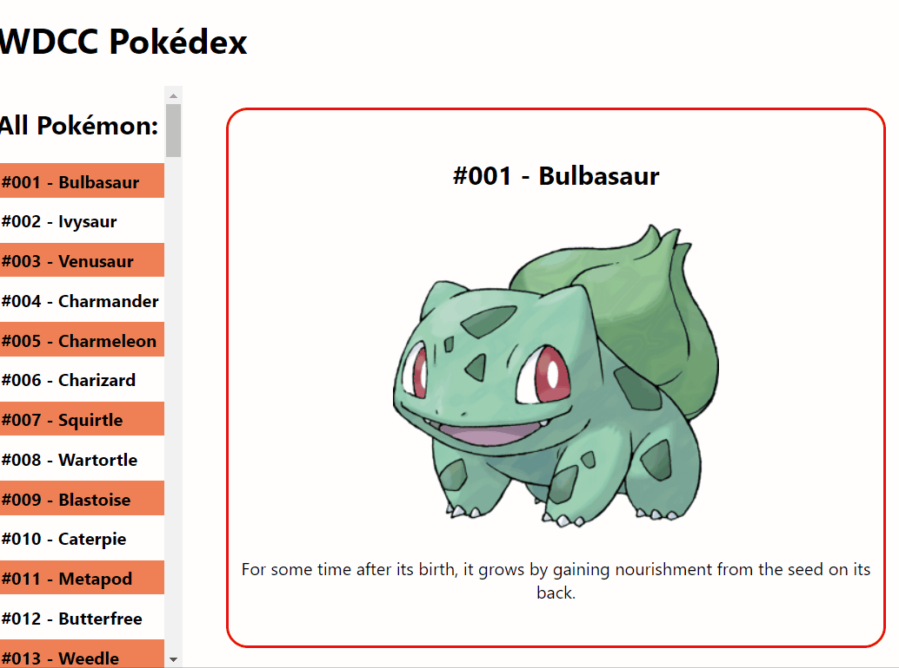

## Session Two - A prettier product
In the second session, we'll allow our app to change its *state* in response to user input, by displaying different Pokémon data when the user clicks different elements on-screen. Then, we'll unleash our creative juices, and style our 'dex to give it a personal touch.

### 2A) Representing state
Continuing right from where we left off in session one, we'll add the functionality to *change* which Pokémon is displayed in the `PokemonDetail` component, whenever we click on one of the Pokémon in the `PokemonList`.

In React apps, component state should be created using the `useState()` React hook. If we don't do this, then React won't be able to detect any state changes and re-render the UI when required.

In our app, we have two pieces of state:
1. The entire Pokémon array; and
2. The Pokémon we're currently viewing in `PokemonDetail`.

Representing our state correctly is especially important for #2, because we want to *change* this state at runtime in response to user input, and have our UI be updated properly.

`useState()` takes one argument (the initial value, if any), and returns an array with two values. The first return value is the stateful value itself, while the second is a function which can be used to update that value. For example:

```jsx
function Counter() {
    const [count, setCount] = useState(0);

    return (
        <button onClick={() => setCount(count + 1)}>This button has been clicked {count} times!</button>
    )
}
```

The code above renders a button which keeps track of how many times it has been clicked. When the user clicks the button, its `onClick` event will be raised, causing the arrow function we defined to be called. That will in turn call `setCount()` to increment the `count` value by 1. React will detect this state change and re-render the component, causing the new `count` to immediately be displayed.

Now, we'll add our two required stateful values to `App.js`. The initial value for the array can be the array obtained from `pokemon.json`, while the initial value for the current Pokémon can be the first element in the array. As well as createing these values using `useState()`, make sure to update your code so that these values are actually used in your JSX.

### 2B) Changing state
Next, we'll implement the functionality that allows the user to view different Pokémon within `PokemonDetail`, when their names are clicked within `PokemonList`. To do this, we need to detect when a `<li>` is clicked within our `PokemonList`, then pass that event back to `App.js` in such a way that it knows which `<li>` - and therefore Pokémon - was clicked. We'll then update our `currentPokemon` state accordingly, which will cause the UI to re-render.

Let's start with the *second* bit first. Within `App.js`, We'll assume that `PokemonList` has an event prop called `onPokemonClick`, which will supply the clicked Pokémon as an arg. For example:

```jsx
<PokemonList list={pokemonList} onPokemonClick={(pokemon) => console.log(pokemon)} />
```

Now, let's implement that prop within `PokemonList`.  Within the mapping function supplied to `map()`, where you're creating the array of `<li>`'s, you'll have access to the Pokémon corresponding to that `<li>`. So, update each `<li>` so that, when clicked, the `onPokemonClick` function will be called, with that Pokémon supplied as an arg. Test this to make sure it's working - one way is to log the supplied Pokémon to the console, as shown above.

Now, complete your code by updating your `currentPokemon` state with the supplied value, rather than logging it to the console. Now, whenever you click the list, you should see the displayed Pokémon update.

### 2C) Styling
For the rest of this session, we'll unleash our creative juices and style our app! This section of the document is deliberately short and open, as we encourage everyone to have a go at making their app their own (perhaps looking to other Pokédex apps online for inspiration) - though one possibility of what it might look like is shown below.

Remember that there are two main ways of styling React apps. The first is to define "normal" CSS files, and import those files. One example of this is already given, in `index.css` (which is imported from `index.js` using the line `import './index.css';`). Any CSS in these files are *global* - that is, they apply to all of your compoments.

Alternatively, you can create CSS *modules*, using the filename convention `*.module.css`. CSS in these modules can be imported into individual compoments, and will be *local* to those compoments. The benefits of this approach are that naming conflicts are avoided (e.g. the `.listItem` CSS class defined in one CSS module is different to the `.listItem` CSS class defined in another CSS module). The drawback is that each CSS rule you define in a module must start with a class selector.

Here's a simple example showing the use of a CSS module:

```css
/* RedButton.module.css */
.button {
    background-color: red;
}
```

```jsx
import styles from './RedButton.module.css';

function RedButton() {
    return (
        <button className={styles.button}>I'm a big red button!</button>
    )
}
```

